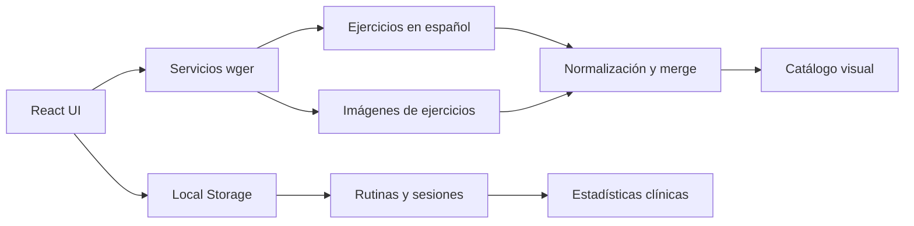

# CMBI FITNESS

## Centro Médico de Bienestar Integral

> Una consola de entrenamiento y rehabilitación donde la biomecánica deja de vivir en una libreta y empieza a trabajar contigo.


**CMBI Fitness** es una aplicación frontend para diseñar, ejecutar y analizar planes de ejercicio con enfoque clínico. Combina rutinas terapéuticas, seguimiento de sesiones, un catálogo biomecánico y herramientas para convertir datos de entrenamiento en decisiones útiles.

<div align="center">

**React 18** · **TypeScript** · **Vite** · **Tailwind CSS** · **wger REST API**

</div>

---

## La experiencia

### Rutinas que piensan en movimiento

- Protocolos preconstruidos para readaptación lumbar, estabilidad central e hipertrofia funcional.
- Días, bloques, superseries y configuraciones progresivas de carga.
- Constructor de rutinas para adaptar el programa al paciente y al contexto real.

### Sesiones sin fricción

- Modo de sesión activa con series intercaladas para superseries.
- Registro de peso, repeticiones, RIR y descansos.
- Progresión por iteraciones para que cada semana tenga dirección.

### Métricas que cuentan una historia

- Volumen total, series, repeticiones y estimación de 1RM mediante Brzycki.
- Distribución de trabajo por grupo muscular.
- Lectura de cadenas cinéticas: empuje, tracción, piernas y core.

### Un catálogo con contexto

- Ejercicios en español alimentados por wger.
- Cruce paralelo de ejercicios e imágenes mediante `Promise.all`.
- Búsqueda remota con debounce, filtros por músculo y equipamiento.
- Fallback clínico local para que la aplicación siga siendo útil cuando la API no responde.

### Herramientas para consulta

- Fichas de ejercicio con señales biomecánicas y equipamiento.
- Glosario de conceptos de biomecánica y rehabilitación.
- Dashboard de pacientes y reportes exportables.
- Configuración opcional de autenticación con token o JWT de wger.

---

## Arquitectura de alto nivel



La frontera de datos vive en `src/services/wgerApi.ts`: la interfaz recibe modelos listos para renderizar, incluyendo `image_url`, y no necesita conocer la forma cruda de wger.

---

## Stack

| Capa | Tecnología |
| --- | --- |
| UI | React 18 |
| Lenguaje | TypeScript |
| Build tool | Vite |
| Estilos | Tailwind CSS |
| Datos externos | wger REST API v2 |
| Persistencia local | Local Storage |
| Exportación | html2canvas + jsPDF |
| Drag and drop | @hello-pangea/dnd |

---

## Ejecutar localmente

```bash
npm install
npm run dev
```

Abre la URL que indique Vite, normalmente `http://localhost:5173`.

### Validar producción

```bash
npm run build
npm run preview
```

### Configuración opcional

Puedes crear `.env.local` para proporcionar una credencial de wger:

```bash
VITE_WGER_API_KEY=tu_token
```

La aplicación también funciona en modo anónimo y conserva un catálogo clínico local como respaldo.

---

## Estructura esencial

```text
src/
├── App.tsx
├── components/
│   ├── ClientDashboard.tsx
│   ├── ExerciseCard.tsx
│   ├── GymMode.tsx
│   ├── RoutineBuilder.tsx
│   ├── RoutineExplorer.tsx
│   └── StatsDashboard.tsx
├── services/
│   ├── exerciseDatabase.ts
│   └── wgerApi.ts
└── types/
    └── wger.ts
```

---

## Principios del proyecto

1. **Primero el movimiento:** cada rutina debe tener una intención biomecánica clara.
2. **Datos útiles, no ruido:** las métricas deben ayudar a ajustar el siguiente paso.
3. **Resiliencia frontend:** el catálogo sigue funcionando aunque una integración externa falle.
4. **Privacidad práctica:** la información local se mantiene en el navegador y no exige backend para empezar.
5. **Cero Docker:** desarrollo frontend directo, ligero y listo para iterar.

---

## Estado del proyecto

Aplicación funcional en evolución para prototipado clínico, entrenamiento personal y seguimiento de pacientes de CMBI Fitness.

**Hecho para convertir una sesión en progreso medible.**
